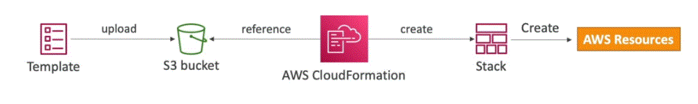
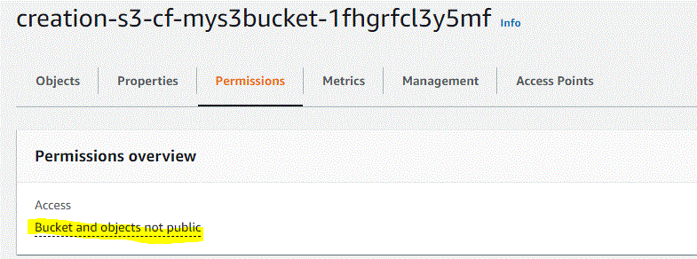
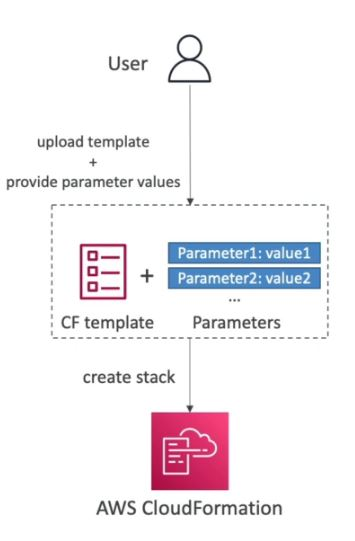

# CloudFormation 
## Introduction 
- declarative way of outlining AWS infra for any resources
- cloud formation creates resources in the right order with exact configurations 
- Example: 
  - Security Group
  - Two EC2 instances using a Security Group
  - Two Elastic IPs with Three Ec2 instances
  - S3 bucket 
  - Load balancer in front of Ec2 
- Tools:
  - CloudFormation Designer
- Benefits
  - Infrastructure as Code
    - No resources are created manually, which is excellet for control 
    - Code can be versioned controlled in git
    - Changes to the infrastructure are reviewed through code 
- Cost
  - Each resource within a stack is tagged
    - Its easy to know how much a stack cost
  - Cost estimation of the resources can be done directly by using cloudformation template 
  - Saving strategy: In dev, you could automate deletion of templates at 5pm and recreated at 8 Am safely
- Productivity 
  - Ability to destroy and recreate infra at fly
  - Generation of diagram from your templates 
  - Declarative programming (No need to figure out ordering and orchestration)
- Separation of concern
  - Create many stacks for many apps and many layer
    - Example
      - VPC stack
      - Network Stack
      - App stack
- Dont reinvent the wheel
  - Leaverage existing templates from the web 
  - Leaverage the documentation
## Tools
-  cfn-lint 
   -  to parse the template and show problems with it.
   -  pip install cfn-lint --user
-  pydot 
   -  preview the template as a graph of resources
   -  pip install pydot

## Cloudformation_Workings
- Workings
  - Templates must be uploaded into s3 and then referenced into cloudformation 
  - To Update a template, we can't edite previous onces. We have to reupload a new version of the template in AWS
  - Stacks are identified by name
  - Deleting the stack will delete all the instances which have got created
  - Image
    - 

## Getting_Started
- Tool 
  - https://www.json2yaml.com/ 
- YAML
  - Key Value Pairs
  - Nested Objects
  - {having a - } are Support Arrays
  - Multi line Strings within "|"
- CF Update Behaviour
  - Cloud formation updates resources based on difference between what you submit and stacks current template
  - Which method to use depends on which property you update for a resource
    - Update with No interruption
      - Without disrupting resources operation & without changing physical ID
      - Example: updating the IAM instance profile (IamInstanceProfile) of an EC2 instance
      - 
    - Update with Some interruption
      - Example: Updating an Ec2 instance type(InstanceType) from t2.micro to t2.large
    - Replacement
      - Recreating the resource with an new physical ID
      - Creates the new resources, change reference from other resources to the new resource, then deletes the old resource
      - Example: Updating the RDS DB instance availability zone 
      - During Update of replacement of s3 bucket
        - New physical resource is created and once its created 
        - Older one is deleted
  - Deleting a S3 bucket 
    - You cannot delete a non empty s3 bucket 
    - To delete an non empty s3 bucket, all the objects inside it first be deleted
  - CF Template Options
    - Paramaters that are commons to any CF template 
      - Tags
      - Permission (IAM Role)
      - Notification Options -SNS
      - Timeout
      - Rollback on Failure
      - Rollback Configuration (Monitoring time & CloudWatch Alarm)
      - Stack policy
      - Termination protection
      - Quick Start link
  - CF Desinger
    - CF desinger can really help visualize a cf stack
    - Its very handy to just quickly draft a cloudformation template 
    - It has strong capabilities to very that your template is also well written
  - CF Building Blocks
    - Template components 
      - AWSTEmplateFormatVersion: Identifies the cpabilities of the template ("2010-09-09")
      - Description: Comments about the template 
      - Transform: Specifies one or more MAcros that used to process the template
      - Metadata
      - Resource: Your aws reources declared in tht template (Mandatory)
      - Parameters: the dynamic inputs for your template
      - Mappings: the static variables for yor template
      - Outputs: Reference to what has been created
      - COnditional: List of conditions to perform resource creation
      - Rules: Validate a parameters(s) during stack creation/update
      - Template helpers(learning as we encounter)
        - Functions
        - Refrences
  - Deploying CF templates
    - Manual way
      - Editing templates in CF desinger or code editor
      - Using the console to input parameters
      - 
    - Automated way
      - Editing templates in YAML file 
      - Using the AWS CLI to deploy the templates or using a CD tool
      - Fully automated flow 
  - Costing estimation
    - Review has EstimateCost link 
      - Which will help us calculate cost for the stack montly
  - Parameters
    - Parameters are a way to provide inputs to your AWS CF template
    - 
    - Paramaters have types, which can prevent errors
    - Paraneters can be cross-validated using roles 
    - Ask yourself this 
      - Is this cf resource configuration likely to change int he future ? 
      - If so, make it paramete. So that we dont have to re-upload a template to change its content
  - Parameter settings 
    - Type: 
      - String
      - Number
      - CommaDelimitedList
      - List<Number>
      - AWS-Specific Parameter
      - List<AWS-Specific Parameter>
      - SSM Parameter (get parameter value from SSM Parameter store)
      - Description
      - ConstraintDescription
      - Min/MaxLength
      - Min/MaxValue
      - Default
      - AllowedValues(array)
      - AllowedPattern(regex)
      - NoEcho (Boolean)
    - To reference a parameter
      - The Fn:Ref function can be leveraged to refrence parameters
      - Parameters can be used anywhere in a template except:
        - AWSTemplateFormatVersion
        - Description
        - Tranform
        - Mapping
